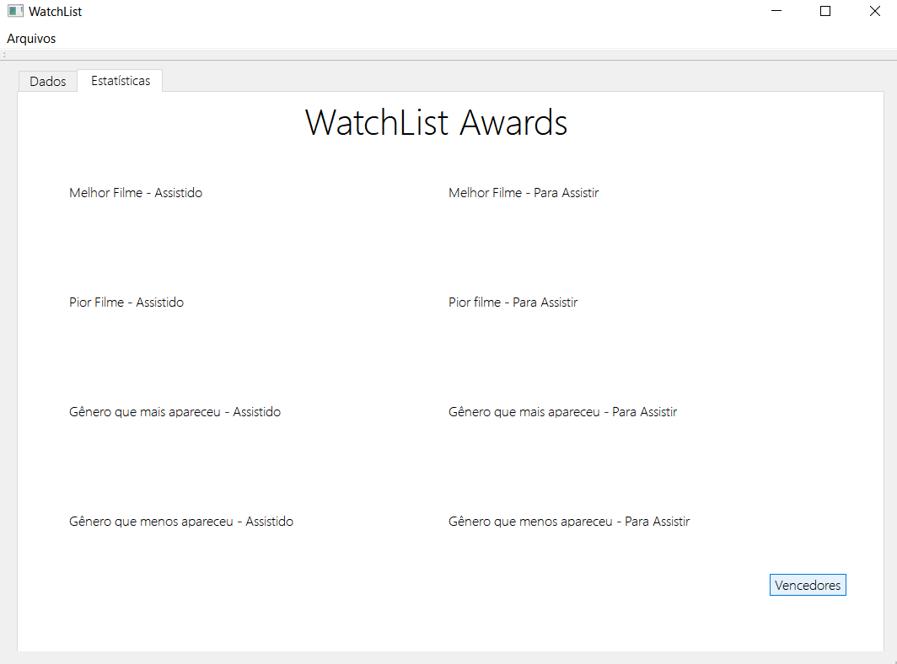

# WatchList
### Projeto feito utilizando Qt Creator para a disciplina de Técnicas de Programação 2018.2. WatchList é uma aplicação que cadastra e gerencia filmes de acordo com dados fornecidos pelos usuários.

WatchList permite que o usuário cadastre filmes, suas notas dadas pela crítica, notas dadas pelo público, gênero, link para a resenha do filme e se ele foi assistido ou não.

Além da tela de cadastro e amostragem dos filmes inseridos, o WatchList possui uma tela de estatísticas chamada WatchList Awards, que mostra o filme com melhor nota, pior nota e os gêneros que mais apareceram na seleção do usuário.

# Manual do Usuário
### WatchList possui um layout fácil e acessível que possibilita uma utilização rápida e intuitiva, mas como um bom aplicativo, temos um guia para tornar sua vida de cinéfilo mais fácil! 

Além do acesso pelo README.md desse repositório, temos um botão na tela inicial do aplicativo que quando clicado, redireciona para esse documento!

### Como começar a usar?

É muito fácil! Basta inserir os dados pedidos na tela inicial e definir se o filme foi assistido ou não. Clicando no botão "Inserir filme" ele vai ser automaticamente redirecionado para a tabela que pertence. Como exemplo, usaremos o filme Django Livre.

Pronto, agora sabemos as notas dadas ao filme pela crítica e pelo público, o nome e gênero e o link do review de onde tiramos os dados. Agora é hora de cadastrar.

Como o filme já foi assistido, ele será inserido na tabela dos Filmes Assistidos. Na tabela, será mostrada a média calculada internamente a partir das notas, a label review e o nome do filme cadastrado. Basta clicar no botão e...

Para inserir filmes que você ainda não assistiu, basta fazer o cadastro com o status "Não Assistido". Ele será cadastrado com os mesmos aspectos na tabela dos "Filmes Para Assistir".

### Como ordenar os filmes por nome? E por nota?

Contamos com dois botões que possibilitam a ordenação a partir desses dois critérios de maneira rápida. Basta clicar na sua opção preferida e os filmes serão mostrados automaticamente na tabela. A primeira imagem mostrará os filmes ordenados por nota e a segunda, por nome.

### Como usar o WatchList Awards?
Apenas precisa acessar a segunda página do aplicativo e clicar em "Vencedores". Os escolhidos de cada categoria serão mostrados nos lugares correspondentes.

### Errei o nome ou a nota quando inseri o filme, como posso editar?

Você pode alterar os dados das notas se clicar duas vezes na célula da nota e o nome de filme se clicar duas vezes na célula do nome do filme.

#### Filme
Após clicar duas vezes na célula do filme, aparecerá uma caixa de mensagem perguntando se você quer alterar o nome do filme.

Se você clicar em "Yes", uma caixa de entrada de dados aparecerá e você poderá colocar o nome alterado.

#### Nota

Após clicar duas vezes na célula da nota, aparecerá uma caixa de mensagem perguntando se você quer alterar o nome do filme.

Se você clicar em "Yes", duas caixas de entrada de dados aparecerão e você poderá alterar a nota do público e da crítica para recalcular a média.

### Como salvar os filmes em um arquivo? E como carregar os filmes de um arquivo existente?

Como tudo nesse app, não tem complicação! Basta selecionar a opção Salvar Assistidos/Salvar Para Assistir e todos os filmes serão salvos em arquivos de texto (.txt) ou separados por vírgula (.csv).

Para carregar também é muito fácil, basta selecionar um arquivo que respeite o formato lido pelo app (todas informações separadas por vírgulas) e ele será mostrado automaticamente dentro das tabelas e estará pronto para ser lido nas estatísticas, ordenado por nome, nota e ter o review visitado.

### Como acessar os reviews dos filmes cadastrados no aplicativo?

Para acessar, basta clicar duas vezes na célula central da tabela, a que contém a palavra review, e uma janela do navegador abrirá automaticamente no review inserido no ato do cadastro. O filme que usaremos como exemplo é O Poderoso Chefão.

Além das reviews cadastradas, também podemos acessar o site "Rotten Tomatoes" através do botão "Reviews" localizado na tela inicial. Escolhemos o Rotten Tomatoes como o site padrão pois é um dos mais completos no segmento.

#### Boa maratona de filmes!
